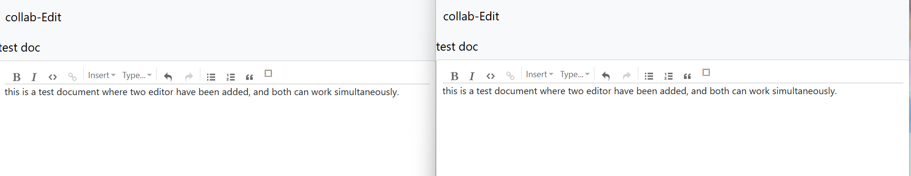

# Real-Time Collaborative Text Editor

**Video and image showcasing the project :-**

[Watch the video](https://1drv.ms/v/s!Av10f2BI9V6ZmUtPmykkbuzDdF2s)

This is a web-based collaborative application that providing seamless and synchronous document editing by multiple users in real-time. It utilises web sockets for live updates, Redis for managing session states and message queues, and MongoDB for persistent data storage.

# Purpose of This Project
# 1) Security and Privacy Concerns
This project addresses the concerns of regulated industries, such as finance, healthcare, security, and legal services, by providing the option to run the collaborative editor on the organization's own server. By hosting the application in a private, secure environment, organizations can maintain full control over sensitive data, reducing the risk of data exposure to third-party services. This approach also helps ensure compliance with industry-specific data privacy and security regulations.
# 2) Greater Flexibility
A custom-built editor can be more easily integrated into a company’s existing software ecosystem and tools. By tailoring the editor to meet specific business needs, it ensures smoother workflows, better compatibility with internal systems, and enhanced control over customization, all while minimizing disruptions to existing processes.
# 3) Control over Innovation and Experimentation
A custom editor provides the flexibility to experiment with innovative approaches to improve user experience while offering greater control over future software updates and changes. This enables companies to tailor the editor’s functionality and interface to meet evolving user needs, without being dependent on external updates or limitations imposed by third-party solutions.
# 4) Avoiding Risks of Third-Party Dependencies
Relying on third-party solutions comes with the risk of support discontinuation or unexpected price increases in the future. Additionally, licensing fees for advanced features can add significant costs over time. In contrast, a custom-built editor eliminates these concerns, offering full control over features and long-term cost stability without the need for ongoing licensing fees.

# Architecture
# 1) Google Login via OAuth 2.0 Authentication
This application implements user authentication through Google Login using OAuth 2.0. The authentication flow is handled by Passport.js with the passport-google-oauth20 strategy. To set up Google login, you'll need to create OAuth credentials in the Google Cloud Console, which will provide the clientID and clientSecret required for the integration.

The authentication flow consists of two main routes:

**/auth/google:**
This route triggers the Google login process by redirecting users to Google’s authentication page, where they can log in and grant necessary permissions.

**/auth/google/redirect:**
Once the user logs in, Google redirects them to this route, where Passport.js handles the OAuth callback. The user’s profile information is then retrieved, and if the user is not already registered, a new user is created in the database. If they are an existing user, their profile is retrieved, and the session is initialized.

# 2) Rich Text Editing with ProseMirror
This project integrates ProseMirror, a powerful toolkit for building rich text editors. ProseMirror allows for flexible, extensible text editing with support for custom schema and document transformations. In this project, the editor is built using ProseMirror’s basic schema, with additional capabilities such as list support provided by the **prosemirror-schema-list** package.

The editor is initialized using the **EditorState** and **EditorView** classes, which manage the state of the editor and handle rendering respectively. The schema is customized by adding list nodes, and a collaborative editing feature is enabled with **prosemirror-collab**, allowing multiple users to interact with the document in real-time. Changes made in the editor are captured using steps and transactions, with support for sending and receiving these changes to/from other collaborators.

For easy setup and configuration, the **prosemirror-example-setup module** is used, providing a base configuration that includes common editor features such as bold, italic, headings, and more. The resulting editor is highly customizable and can be extended to meet the needs of specific applications, offering a seamless and rich text editing experience.
# 3) Why Use ws Over socket.io?
In this project, we've chosen the **ws library** for WebSocket communication over **socket.io** for several reasons:

**Lightweight and Fast:** ws is a minimal, high-performance WebSocket library designed to be simple and fast. It provides a small footprint with fewer dependencies, which helps reduce the size of your application's dependency tree and improves performance.

**High Concurrency Support:** ws is optimized for handling a large number of concurrent WebSocket connections, making it ideal for applications that need to scale efficiently.

**Complete Flexibility:** Unlike socket.io, which abstracts many WebSocket features ws offers complete flexibility. This allows us to define custom protocols, message formats, authentication logic, and connection management exactly as needed for the project.

By choosing ws, we've prioritized performance, control, and a smaller application footprint, which makes it a perfect fit for this project.

# 4) WebSocket Implementation
This project uses WebSocket to establish a full-duplex communication channel between the client and the server, enabling real-time interaction. The WebSocket server is built on top of an Express.js application, utilizing the **ws library** for WebSocket support.

The WebSocket server is created by first setting up an HTTP server with **http.createServer(app)**, where app is the Express application. The ws WebSocket server is then instantiated with this HTTP server, allowing for real-time message exchange between the server and connected clients. The WebSocket connection enables efficient communication without the overhead of constantly polling the server, making it ideal for use cases like real-time data feeds.
# 5) Collaborative Document Storage
The application temporarily stores document data in Redis before persisting it to a MongoDB database under two conditions to ensure efficient storage and reduce database load:

**Step-Based Saving:** After a predefined number(ie 20 steps) of user actions (steps) in the ProseMirror editor, the document data is automatically saved to the database. This ensures that changes are captured at regular intervals, preventing data loss while minimizing unnecessary database writes.

**Timeout-Based Saving:** In addition to step-based saving, the document is also saved from Redis to MongoDB after a set timeout period using **setTimeout()**. This mechanism ensures that if there are no changes from the user for a certain period, the document is still safely saved to the database to prevent data loss.
# 6) Redis Integration
In our project, Redis is utilized to efficiently manage WebSocket connections and document data, enabling real-time collaboration features. Specifically, we store the WebSocket socket ID associated with each client working on a specific document using the command **client.sAdd('socId:docId:${this.docId}', this.socId)**. This allows us to track which socket IDs are currently active for a given document, facilitating seamless communication between clients. Additionally, the document's data itself is stored in Redis with **client.set('docId:${this.docId}', JSON.stringify(this.doc))**, ensuring that the latest state of the document is readily available in memory.

# Future Enhancements
# 1) AI-Powered Features
The project aims to incorporate intelligent features such as auto-completion, grammar corrections, spell-checking, and style suggestions based on the specific purpose or context of the content. These advanced tools will help users create more polished, error-free content by offering real-time suggestions, improving writing efficiency, and ensuring the final output aligns with desired writing standards.
# 2) Integrated Multi-Media Collaboration
Future developments will include the integration of multimedia collaboration features, such as the ability to incorporate images, audio, and video into the project. Additionally, real-time code execution and interactive content will be supported, allowing users to collaborate seamlessly across different media types and enhance the interactivity and functionality of the platform.
# 3) Adding features for audio and video conferencing
Plans for future updates include the integration of audio and video conferencing features, enabling seamless communication and collaboration between users. This will allow real-time discussions, presentations, and team coordination directly within the platform, enhancing both productivity and user engagement.
# 4) Cross-Platform and Cross-Device Collaboration
The integration and collaboration capabilities across web, desktop, and mobile apps to ensure a seamless user experience as you switch between devices. These enhancements are designed to provide better continuity of work, stronger synchronization, and a unified user interface across platforms
# 5) Maintain Document History
To support effective collaboration, Document Change History and Version Control will be integrated into the system, ensuring that every edit, comment, and change made to documents can be tracked, reviewed, and reverted if necessary. This feature is critical for teams working in collaborative environments.

